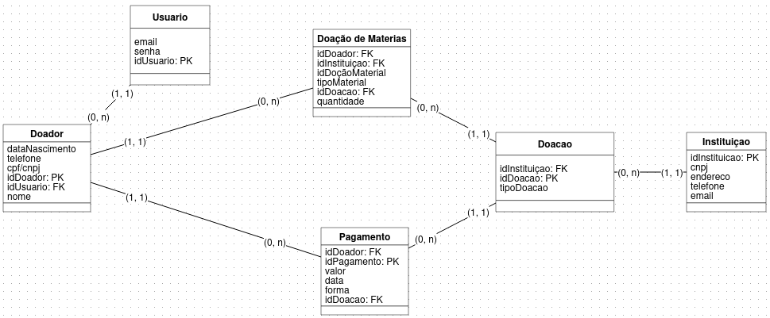

# Backend Doe Mais

## Sobre

Backend do aplicativo Doe Mais, projetado para gerenciar uma plataforma que facilita doações para instituições. O sistema permite contribuições financeiras e materiais, acompanhamento de campanhas, visualização das instituições beneficiadas e integração entre doadores e causas, promovendo uma rede de solidariedade.

O aplicativo oferecerá múltiplas formas de doação financeira, garantindo acessibilidade e conveniência para os usuários.

## Tecnologias Utilizadas:
- Node JS
- Typescript
- Express Js
- Firebase
- API Mercado Pago


## Modelo Banco


## Instalação

1. Clone o repositório:
```bash
    git clone git@github.com:doemais-ifbaiano/backend.git
```
 
2. Copie em um arquivo .env as variáveis necessárias e altere de acordo com o ambiente passado:
```bash
    cp .env.example .env
 ```
3. Instale as dependências:

    OP 1
    
    ```bash
    npm install
    ```

    OP 2

    ```bash
    yarn install
    ```

4. Inicialize o Prisma ORM:
```bash
    npx prisma init
```

Modifique a linha gerada pelo Prisma para o formato abaixo:

```bash
    DATABASE_URL="postgresql://${DB_USER}:${DB_PASSWORD}@${DB_HOST}:${DB_PORT}/${DB_DATABASE}?schema=public"
```

5. Configure o Docker:


```bash
    docker compose up -d
```

6. Inicialize o projeto:
```bash
    npm start
```

## Licença
Este projeto está licenciado sob a Licença GNU GPL - veja o arquivo [LICENÇA](LICENSE) para detalhes.
